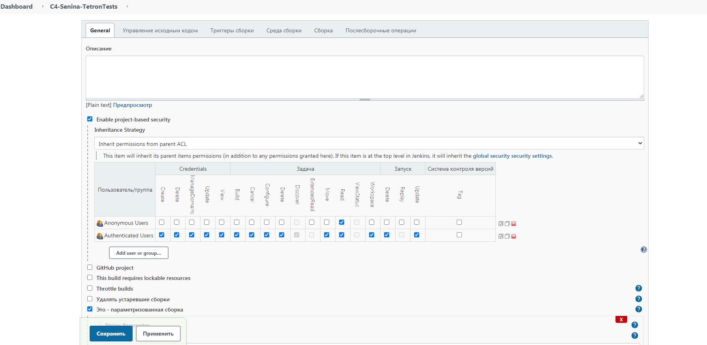
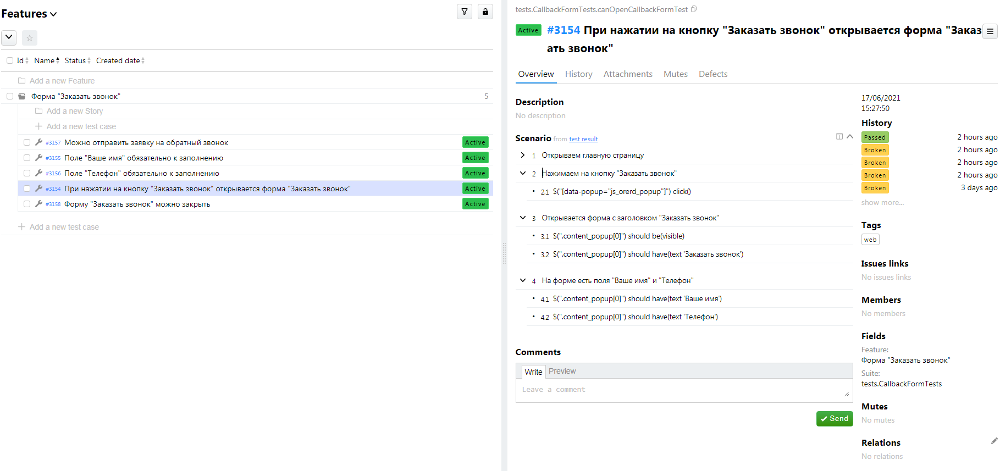
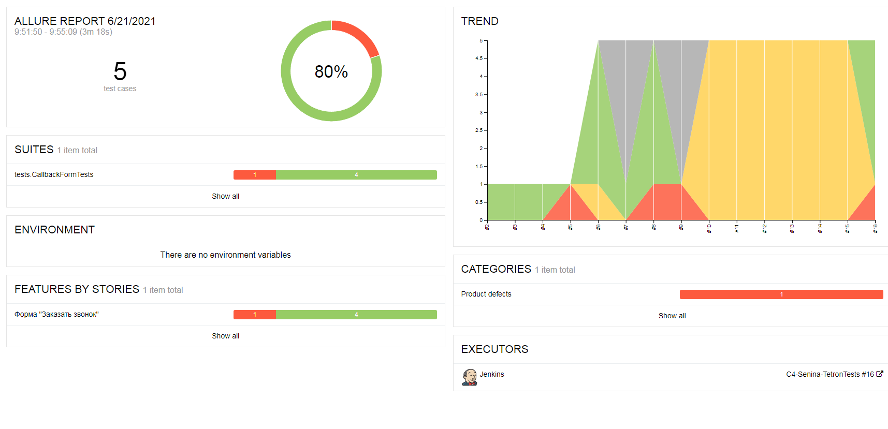
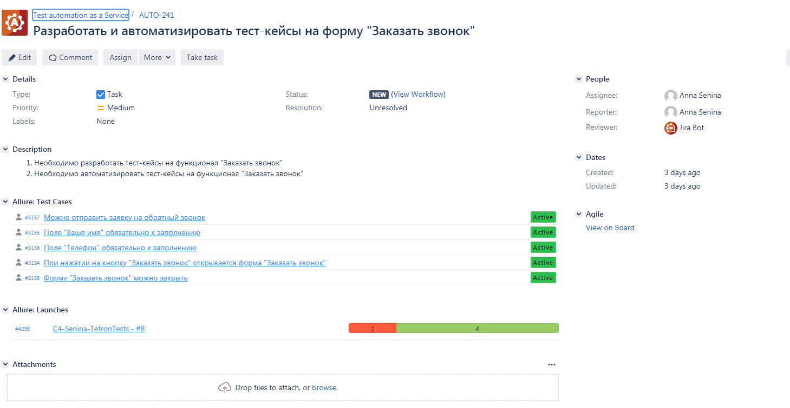
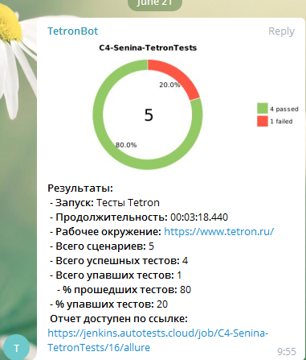

# Автотесты на форму Заказать звонок https://www.tetron.ru/

## Используемые технологии:
**Тесты:** Java, Gradle, Junit5, Selenide

**Отчетность:** Allure Reports

**CI:** Jenkins

**TMS:** Allure TestOps

**Запуск тестов:** Selenoid
 
**Уведомление:** Telegram Bot

**Task Tracker:** Jira

## Реализованы проверки формы Заказть звонок
- [X] - При нажатии на кнопку "Заказать звонок" открывается форма "Заказать звонок"
- [X] - Поле "Ваше имя" обязательно к заполнению
- [X] - Поле "Телефон" обязательно к заполнению
- [X] - Форму "Заказать звонок" можно закрыть
- [X] - Можно отправить заявку на обратный звонок

## Запуск тестов происходит в Jenkins
[Ссылка](https://jenkins.autotests.cloud/job/C4-Senina-TetronTests/) на джобу в Jenkins: 

## Управление тестами и прогонами в AllureTestOps

## Видео прохождения тестов прикладывается к прогону в AllureTestOps

## Отчёт о прогоне в AllureReport
[Ссылка](https://jenkins.autotests.cloud/job/C4-Senina-TetronTests/16/allure/) на отчет

## Реализована связь прохождение тестов с задачей в Jira

## После прогона тестов приходит сообщение от бота в Telegram
[Ссылка](https://t.me/joinchat/X76tUcthckFlZTIy) на чат, куда приходят уведомления 

